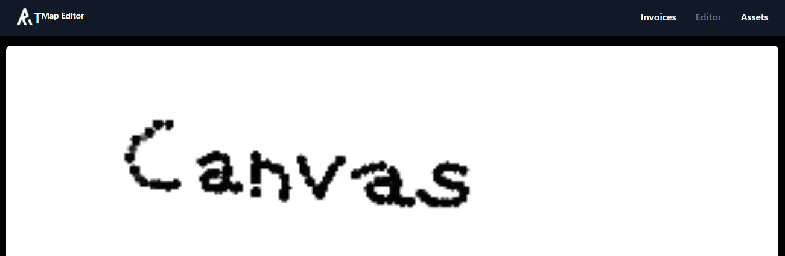

# AT Map Editor

[](https://github.com/Reterics/at_map_editor/actions/workflows/npm-publish-github-packages.yml)

This project is going to be a Canvas/THREE.js Map editor for my Another Try THREE.JS based game in order to create scenes.
Created in [Next.js](https://nextjs.org/).



## Install

For the latest stable version

```bash
npm install
npm run build
npm run start
```


## Contribute

There are many ways to [contribute](https://github.com/Reterics/invoice-management/blob/main/CONTRIBUTING.md) to Invoice Management.
* [Submit bugs](https://github.com/Reterics/invoice-management/issues) and help us verify fixes as they are checked in.
* Review the [source code changes](https://github.com/Reterics/invoice-management/pulls).
* [Contribute bug fixes](https://github.com/Reterics/invoice-management/blob/main/CONTRIBUTING.md).

